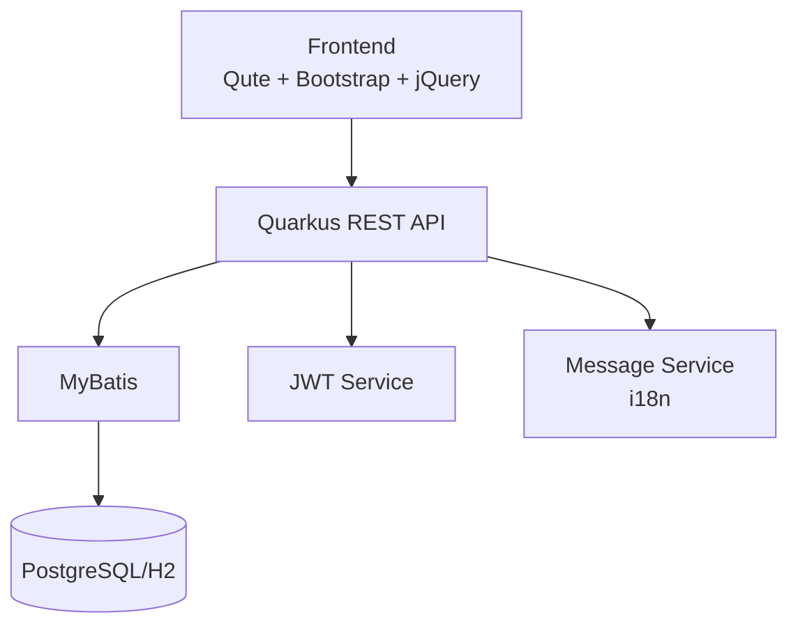

# Quarkus 認証・権限管理システム

[](https://quarkus.io/)
[](https://openjdk.org/)
[](https://www.postgresql.org/)
[](LICENSE)

> 🚀 **企業レベルの認証・権限管理システムテンプレート**  
> JWT認証、ロールベースアクセス制御、国際化対応、MyBatis統合

## ✨ 主要機能

- 🔐 **JWT認証システム** - セキュアなトークンベース認証
- 👥 **ロールベースアクセス制御** - ADMIN/SALES/USER権限管理
- 🌐 **国際化対応** - 日本語/英語/中国語サポート
- 📊 **ダッシュボード** - リアルタイム統計とアクティビティ監視
- 🗄️ **MyBatis統合** - 効率的なデータアクセス層
- 📱 **レスポンシブUI** - Bootstrap 5 + jQuery

## 🚀 クイックスタート

### 前提条件
- Java 21+
- Maven 3.8+

### 起動手順

```bash
# 1. リポジトリクローン
git clone https://github.com/liushuang393/quarkus-template-app.git
cd quarkus-template-app

# 2. 開発モードで起動
./mvnw quarkus:dev

# 3. ブラウザでアクセス
open http://localhost:8080
```

### 初期ユーザー

| ユーザー名 | パスワード | ロール | 説明 |
|-----------|-----------|-------|------|
| `admin` | `password` | ADMIN | 全機能アクセス |
| `user1` | `password` | USER | 基本機能のみ |
| `sales1` | `password` | SALES | 営業機能 |

## 🏗️ アーキテクチャ



### 技術スタック

| 層 | 技術 | バージョン |
|---|------|----------|
| **Backend** | Quarkus | 3.25.0 |
| **Frontend** | Qute + Bootstrap + jQuery | 5.3.0 + 3.7.1 |
| **Database** | PostgreSQL / H2 | 15 / 2.x |
| **ORM** | MyBatis | 3.5.x |
| **Security** | SmallRye JWT | - |
| **Build** | Maven | 3.8+ |

## 📚 ドキュメント

| ドキュメント | 説明 |
|-------------|------|
| [📖 プロジェクト構造](PROJECT_STRUCTURE.md) | ディレクトリ構成とファイル説明 |
| [🗄️ データベース設定](DATABASE_SETUP.md) | DB環境構築手順 |
| [🔧 開発者ガイド](docs/README.md) | 各層の実装ガイド |
| [🌐 国際化ガイド](docs/i18n-guide.md) | 多言語対応の実装方法 |
| [🔒 セキュリティガイド](docs/security-guide.md) | JWT認証とアクセス制御 |
| [🧪 テストガイド](docs/testing-guide.md) | テスト実装方法 |

## 🛠️ 開発コマンド

### 基本操作

```bash
# 開発モードで起動（ホットリロード有効）
./mvnw quarkus:dev

# テスト実行
./mvnw test

# パッケージビルド
./mvnw clean package

# 本番環境で起動
java -jar target/quarkus-app/quarkus-run.jar
```

### Docker

```bash
# JVMモードでDockerイメージ作成
./mvnw package
docker build -f docker/Dockerfile.jvm -t quarkus-auth .

# コンテナ起動
docker run -i --rm -p 8080:8080 quarkus-auth
```

## 🔗 重要なURL

| サービス | URL | 説明 |
|---------|-----|------|
| **アプリケーション** | http://localhost:8080 | メインアプリ |
| **ダッシュボード** | http://localhost:8080/dashboard | 管理画面 |
| **Swagger UI** | http://localhost:8080/q/swagger-ui | API ドキュメント |
| **Dev UI** | http://localhost:8080/q/dev | 開発者ツール |
| **H2 Console** | http://localhost:8080/h2-console | DB管理（開発環境） |
| **Health Check** | http://localhost:8080/q/health | ヘルスチェック |

## 🚨 トラブルシューティング

### よくある問題

<details>
<summary>ポート8080が使用中</summary>

```bash
# 別ポートで起動
./mvnw quarkus:dev -Dquarkus.http.port=8081
```
</details>

<details>
<summary>データベース接続エラー</summary>

開発環境（H2）: アプリケーション再起動  
本番環境（PostgreSQL）: `application-prod.yaml`の接続設定を確認
</details>

<details>
<summary>JWT署名エラー</summary>

```bash
# 鍵ファイルの存在確認
ls src/main/resources/META-INF/resources/*.pem
```
</details>

## 🤝 貢献

プルリクエストや課題報告を歓迎します！

1. このリポジトリをフォーク
2. フィーチャーブランチを作成 (`git checkout -b feature/amazing-feature`)
3. 変更をコミット (`git commit -m 'Add amazing feature'`)
4. ブランチにプッシュ (`git push origin feature/amazing-feature`)
5. プルリクエストを作成

## � 謝辞

このプロジェクトは以下の素晴らしいオープンソースプロジェクトによって支えられています：

### 🚀 フレームワーク・ライブラリ
- **[Quarkus](https://quarkus.io/)** - 超高速起動とクラウドネイティブJavaフレームワーク
- **[MyBatis](https://mybatis.org/)** - 優れたSQL マッピングフレームワーク
- **[Bootstrap](https://getbootstrap.com/)** - 世界で最も人気のあるCSSフレームワーク
- **[jQuery](https://jquery.com/)** - 高速で軽量なJavaScriptライブラリ

### 🛠️ 開発ツール
- **[Maven](https://maven.apache.org/)** - プロジェクト管理とビルドツール
- **[H2 Database](https://www.h2database.com/)** - 高速インメモリデータベース
- **[PostgreSQL](https://www.postgresql.org/)** - 世界で最も先進的なオープンソースデータベース

### 🔒 セキュリティ
- **[SmallRye JWT](https://smallrye.io/)** - MicroProfile JWT実装
- **[BCrypt](https://github.com/patrickfav/bcrypt)** - 安全なパスワードハッシュ化

これらのプロジェクトの開発者とコントリビューターの皆様に深く感謝いたします。

## �📄 ライセンス

このプロジェクトは [MIT License](LICENSE) の下で公開されています。

## 🆘 サポート

- 📖 [Quarkus公式ドキュメント](https://quarkus.io/guides/)
- 💬 [Quarkus Zulip Chat](https://quarkusio.zulipchat.com/)
- 🐛 [GitHub Issues](https://github.com/liushuang393/quarkus-template-app/issues)

---

<div align="center">

**Made with ❤️ using Quarkus**

[⭐ Star this repo](https://github.com/liushuang393/quarkus-template-app) • [🐛 Report Bug](https://github.com/liushuang393/quarkus-template-app/issues) • [✨ Request Feature](https://github.com/liushuang393/quarkus-template-app/issues)

</div>
